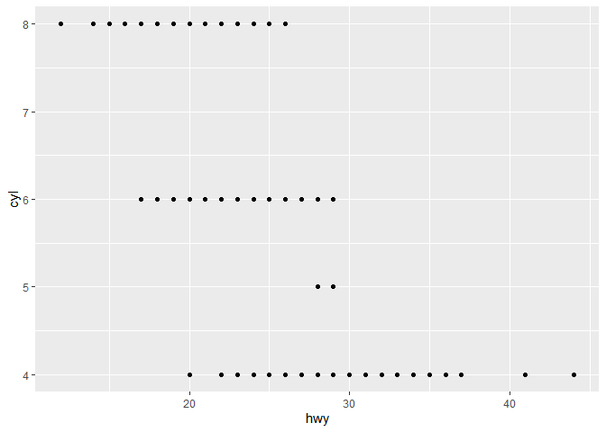
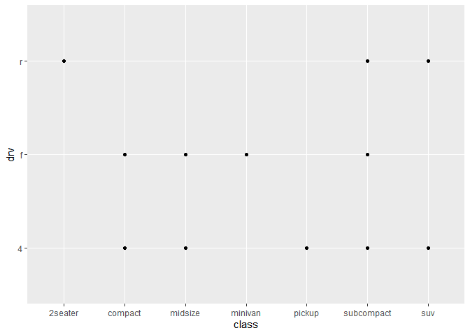
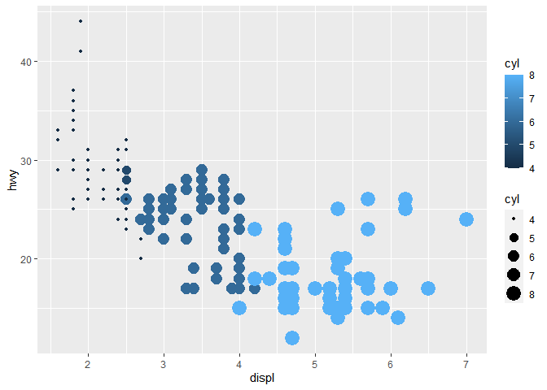
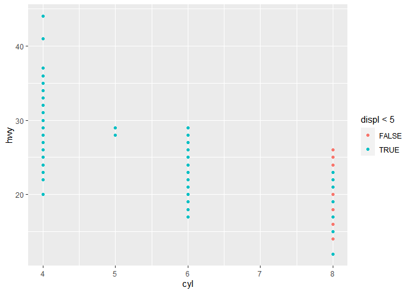

# 3.2.4 Exercises

### 1. Run ```ggplot(data = mpg)```. What do you see?


```r
ggplot(data = mpg) + 
   geom_point(mapping = aes(x = displ, y = hwy))
```

<!-- -->

### 2.How many rows are in ```mpg```? How many columns?

##### There are 8 rows and 13 columns.

### 3. What does the ```drv``` variable describe? Read the ```?mpg``` to find out.

##### The ```drv``` variable describes the type of drive train, where f = front-wheel drive, r = rear wheel drive, 4 = 4wd

### 4. Make a scatterplot of ```hwy``` vs ```cyl```.


```r
ggplot(data = mpg) + 
   geom_point(mapping = aes(x = hwy, y = cyl))
```

<!-- -->

### 5. What happens if you make a scatterplot of ```class``` vs ```drv```? Why is the plot not useful?


```r
ggplot(data = mpg) + 
   geom_point(mapping = aes(x = class, y = drv))
```

<!-- -->


# 3.3.1 Exercises

### 1. What's gone wrong with this code? Why are the points not blue?


```r
ggplot(data = mpg) + 
  geom_point(mapping = aes(x = displ, y = hwy, color = "blue"))
```

<!-- -->

##### The points are not blue because the parenthesis is coded after "blue" and not after y = hwy.

### 2. Which variables in ```mpg``` are categorical? Which variables are continuous? (Hint: type ```?mpg``` to read the documentation for the dataset). How can you see this information when you run ```mpg```?

##### Categorical: manufacturer, model, year, trans, drv, fl, class
##### Continuous: displ, cyl, cty, hwy

### 3. Map a continuous variable to ```color```, ```size```, and ```shape```. How do these aesthetics behave differently for categorical vs. continuous variables?


```r
ggplot(data = mpg) + 
  geom_point(mapping = aes(x = displ, y = hwy, color = cyl, size = cyl))
```

<!-- -->

##### A continuous variable cannot be mapped to shape.

### 4. What happens if you map the same variable to multiple aesthetics?

##### As seen above, the variable will show multiple aesthetics.

### 5. What does the ```stroke``` aesthetic do? What shapes does it work with? (Hint: use ```?geom_point```)

##### The ```stroke``` aesthetic modifies the width of the border.

### 6. What happens if you map an aesthetic to something other than a variable name, like ```aes(colour = displ < 5)```? Note, you’ll also need to specify x and y.


```r
ggplot(data = mpg) + 
  geom_point(mapping = aes(x = cyl, y = hwy, color = displ < 5))
```

<!-- -->

##### If a point has displ < 5, it will show as one color; if a point has displ > 5, it will show as another color.


# 3.5.1 Exercises

### 1. What happens if you facet on a continuous variable?


```r
ggplot(data = mpg) + 
  geom_point(mapping = aes(x = displ, y = hwy)) + 
  facet_grid(cty ~ cyl)
```

<!-- -->

##### The facet grids become unreadable.

### 2. What do the empty cells in plot with ```facet_grid(drv ~ cyl)``` mean? How do they relate to this plot?

```
ggplot(data = mpg) + 
  geom_point(mapping = aes(x = drv, y = cyl))
```


```r
ggplot(data = mpg) + 
  geom_point(mapping = aes(x = drv, y = cyl))
```

<!-- -->

```r
  facet_grid(drv ~ cyl)
```

```
## <ggproto object: Class FacetGrid, Facet, gg>
##     compute_layout: function
##     draw_back: function
##     draw_front: function
##     draw_labels: function
##     draw_panels: function
##     finish_data: function
##     init_scales: function
##     map_data: function
##     params: list
##     setup_data: function
##     setup_params: function
##     shrink: TRUE
##     train_scales: function
##     vars: function
##     super:  <ggproto object: Class FacetGrid, Facet, gg>
```

##### The plot is facetting cyl and drv into cyl and drv, which is why the points are on cross points of the plot instead of in the cells.

### 3. What plots does the following code make? What does ```.``` do?

```
ggplot(data = mpg) + 
  geom_point(mapping = aes(x = displ, y = hwy)) +
  facet_grid(drv ~ .)

ggplot(data = mpg) + 
  geom_point(mapping = aes(x = displ, y = hwy)) +
  facet_grid(. ~ cyl)
```


```r
ggplot(data = mpg) + 
  geom_point(mapping = aes(x = displ, y = hwy)) +
  facet_grid(drv ~ .)
```

<!-- -->


```r
ggplot(data = mpg) + 
  geom_point(mapping = aes(x = displ, y = hwy)) +
  facet_grid(. ~ cyl)
```

<!-- -->

##### The ```.``` makes it so that the data is only categorized by one value.

### 4. Take the first faceted plot in this section:

```
ggplot(data = mpg) + 
  geom_point(mapping = aes(x = displ, y = hwy)) + 
  facet_wrap(~ class, nrow = 2)
```

### What are the advantages to using faceting instead of the colour aesthetic? What are the disadvantages? How might the balance change if you had a larger dataset?


```r
ggplot(data = mpg) + 
  geom_point(mapping = aes(x = displ, y = hwy)) + 
  facet_wrap(~ class, nrow = 2)
```

<!-- -->

##### Using the color aesthetic would allow us to compare the data to all data. However, when we have a larger dataset, it would be easier to use facets as the color aesthetic would become too hectic.

### 5. Read ```?facet_wrap```. What does ```nrow``` do? What does ```ncol``` do? What other options control the layout of the individual panels? Why doesn’t ```facet_grid()``` have ```nrow``` and ```ncol``` arguments?

##### ```nrow``` is the number of rows, and ```ncol``` is the number of columns. Other options to control the layout of individual panels are "facets", "scales", "shrink", "labeller", "as.table", "switch", "drop", "dir", and "strip.position". 
##### ```facet_grid()``` does not have ```nrow``` and ```ncol``` arguments because facets are like cells, and cells do not have rows and columns.

### 6. When using ```facet_grid()``` you should usually put the variable with more unique levels in the columns. Why?

##### Otherwise, the data in the facets would be too crowded to see.


# 3.6.1 Exercises

### 1. What geom would you use to draw a line chart? A boxplot? A histogram? An area chart?

##### 

### 2. Run this code in your head and predict what the output will look like. Then, run the code in R and check your predictions.


```r
ggplot(data = mpg, mapping = aes(x = displ, y = hwy, color = drv)) +
  geom_point() + 
  geom_smooth(se = FALSE)
```

```
## `geom_smooth()` using method = 'loess' and formula 'y ~ x'
```

<!-- -->

### 3. What does ```show.legend = FALSE``` do? What happens if you remove it? Why do you think I used it earlier in the chapter?

##### It does not show the legend.

### 4. What does the ```se``` argument to ```geom_smooth()``` do?

##### It removes the confidence intervals.

### 5. Will these two graphs look different? Why/why not?

```
ggplot(data = mpg, mapping = aes(x = displ, y = hwy)) + 
  geom_point() + 
  geom_smooth()

ggplot() + 
  geom_point(data = mpg, mapping = aes(x = displ, y = hwy)) + 
  geom_smooth(data = mpg, mapping = aes(x = displ, y = hwy))
```

##### They will not look different.

### 6. 


```r
ggplot(data = mpg) +
  geom_point(mapping = aes(x = displ, y = hwy)) +
  geom_smooth(mapping = aes(x = displ, y = hwy), se = FALSE)
```

```
## `geom_smooth()` using method = 'loess' and formula 'y ~ x'
```

<!-- -->


