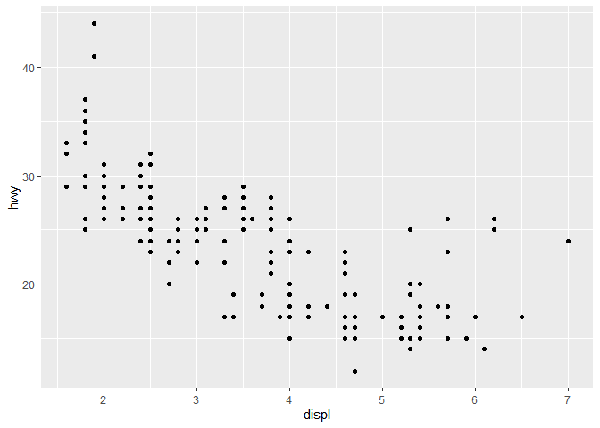

# 4.4 Exercises

### 1. Why does this code not work?

```r
my_variable <- 10
my_variable
```

```
## [1] 10
```

### 2. Tweak each of the following R commands so that they run correctly:
```
library(tidyverse)

ggplot(dota = mpg) + 
  geom_point(mapping = aes(x = displ, y = hwy))

fliter(mpg, cyl = 8)
filter(diamond, carat > 3)
```


```r
library(tidyverse)
```

```
## -- Attaching packages -------------------------------------------------------------------------------- tidyverse 1.3.0 --
```

```
## v ggplot2 3.3.0     v purrr   0.3.3
## v tibble  3.0.0     v dplyr   0.8.5
## v tidyr   1.0.2     v stringr 1.4.0
## v readr   1.3.1     v forcats 0.5.0
```

```
## -- Conflicts ----------------------------------------------------------------------------------- tidyverse_conflicts() --
## x dplyr::filter() masks stats::filter()
## x dplyr::lag()    masks stats::lag()
```

```r
ggplot(data = mpg) + 
  geom_point(mapping = aes(x = displ, y = hwy))
```

<!-- -->


```r
filter(mpg, cyl == 8)
```

```
## # A tibble: 70 x 11
##    manufacturer model     displ  year   cyl trans  drv     cty   hwy fl    class
##    <chr>        <chr>     <dbl> <int> <int> <chr>  <chr> <int> <int> <chr> <chr>
##  1 audi         a6 quatt~   4.2  2008     8 auto(~ 4        16    23 p     mids~
##  2 chevrolet    c1500 su~   5.3  2008     8 auto(~ r        14    20 r     suv  
##  3 chevrolet    c1500 su~   5.3  2008     8 auto(~ r        11    15 e     suv  
##  4 chevrolet    c1500 su~   5.3  2008     8 auto(~ r        14    20 r     suv  
##  5 chevrolet    c1500 su~   5.7  1999     8 auto(~ r        13    17 r     suv  
##  6 chevrolet    c1500 su~   6    2008     8 auto(~ r        12    17 r     suv  
##  7 chevrolet    corvette    5.7  1999     8 manua~ r        16    26 p     2sea~
##  8 chevrolet    corvette    5.7  1999     8 auto(~ r        15    23 p     2sea~
##  9 chevrolet    corvette    6.2  2008     8 manua~ r        16    26 p     2sea~
## 10 chevrolet    corvette    6.2  2008     8 auto(~ r        15    25 p     2sea~
## # ... with 60 more rows
```


```r
filter(diamonds, carat > 3)
```

```
## # A tibble: 32 x 10
##    carat cut     color clarity depth table price     x     y     z
##    <dbl> <ord>   <ord> <ord>   <dbl> <dbl> <int> <dbl> <dbl> <dbl>
##  1  3.01 Premium I     I1       62.7    58  8040  9.1   8.97  5.67
##  2  3.11 Fair    J     I1       65.9    57  9823  9.15  9.02  5.98
##  3  3.01 Premium F     I1       62.2    56  9925  9.24  9.13  5.73
##  4  3.05 Premium E     I1       60.9    58 10453  9.26  9.25  5.66
##  5  3.02 Fair    I     I1       65.2    56 10577  9.11  9.02  5.91
##  6  3.01 Fair    H     I1       56.1    62 10761  9.54  9.38  5.31
##  7  3.65 Fair    H     I1       67.1    53 11668  9.53  9.48  6.38
##  8  3.24 Premium H     I1       62.1    58 12300  9.44  9.4   5.85
##  9  3.22 Ideal   I     I1       62.6    55 12545  9.49  9.42  5.92
## 10  3.5  Ideal   H     I1       62.8    57 12587  9.65  9.59  6.03
## # ... with 22 more rows
```

### 3. Press Alt + Shift + K. What happens? How can you get to the same place using the menus?

##### Tools.


# 5.2..4 Exercises

### 1. Find all flights that

#### 1. Had an arrival delay of two or more hours

##### 

```r
library(nycflights13)
library(tidyverse)
filter(flights, arr_delay == 120)
```

```
## # A tibble: 166 x 19
##     year month   day dep_time sched_dep_time dep_delay arr_time sched_arr_time
##    <int> <int> <int>    <int>          <int>     <dbl>    <int>          <int>
##  1  2013     1     2     1806           1629        97     2008           1808
##  2  2013     1    10     1801           1619       102     1923           1723
##  3  2013     1    13     1958           1836        82     2231           2031
##  4  2013     1    13     2145           2005       100        4           2204
##  5  2013     1    14     1652           1445       127     1806           1606
##  6  2013     1    15     1603           1446        77     1957           1757
##  7  2013     1    21     1957           1815       102     2237           2037
##  8  2013     1    22     1550           1420        90     1820           1620
##  9  2013     1    23     1031            825       126     1337           1137
## 10  2013     1    23     1805           1619       106     1926           1726
## # ... with 156 more rows, and 11 more variables: arr_delay <dbl>,
## #   carrier <chr>, flight <int>, tailnum <chr>, origin <chr>, dest <chr>,
## #   air_time <dbl>, distance <dbl>, hour <dbl>, minute <dbl>, time_hour <dttm>
```

#### 2. Flew to Houston (IAH or HOU)


```r
library(nycflights13)
library(tidyverse)
filter(flights, dest == 'HOU' | dest == 'IAH')
```

```
## # A tibble: 9,313 x 19
##     year month   day dep_time sched_dep_time dep_delay arr_time sched_arr_time
##    <int> <int> <int>    <int>          <int>     <dbl>    <int>          <int>
##  1  2013     1     1      517            515         2      830            819
##  2  2013     1     1      533            529         4      850            830
##  3  2013     1     1      623            627        -4      933            932
##  4  2013     1     1      728            732        -4     1041           1038
##  5  2013     1     1      739            739         0     1104           1038
##  6  2013     1     1      908            908         0     1228           1219
##  7  2013     1     1     1028           1026         2     1350           1339
##  8  2013     1     1     1044           1045        -1     1352           1351
##  9  2013     1     1     1114            900       134     1447           1222
## 10  2013     1     1     1205           1200         5     1503           1505
## # ... with 9,303 more rows, and 11 more variables: arr_delay <dbl>,
## #   carrier <chr>, flight <int>, tailnum <chr>, origin <chr>, dest <chr>,
## #   air_time <dbl>, distance <dbl>, hour <dbl>, minute <dbl>, time_hour <dttm>
```

#### 3. Were operated by United, American, or Delta


```r
library(nycflights13)
library(tidyverse)
filter(flights, carrier == 'UA' | carrier == 'AA' | carrier == 'DA')
```

```
## # A tibble: 91,394 x 19
##     year month   day dep_time sched_dep_time dep_delay arr_time sched_arr_time
##    <int> <int> <int>    <int>          <int>     <dbl>    <int>          <int>
##  1  2013     1     1      517            515         2      830            819
##  2  2013     1     1      533            529         4      850            830
##  3  2013     1     1      542            540         2      923            850
##  4  2013     1     1      554            558        -4      740            728
##  5  2013     1     1      558            600        -2      753            745
##  6  2013     1     1      558            600        -2      924            917
##  7  2013     1     1      558            600        -2      923            937
##  8  2013     1     1      559            600        -1      941            910
##  9  2013     1     1      559            600        -1      854            902
## 10  2013     1     1      606            610        -4      858            910
## # ... with 91,384 more rows, and 11 more variables: arr_delay <dbl>,
## #   carrier <chr>, flight <int>, tailnum <chr>, origin <chr>, dest <chr>,
## #   air_time <dbl>, distance <dbl>, hour <dbl>, minute <dbl>, time_hour <dttm>
```

#### 4. Departed in summer (July, August, and September)


```r
library(nycflights13)
library(tidyverse)
filter(flights, month == 7 | month == 8 | month == 9)
```

```
## # A tibble: 86,326 x 19
##     year month   day dep_time sched_dep_time dep_delay arr_time sched_arr_time
##    <int> <int> <int>    <int>          <int>     <dbl>    <int>          <int>
##  1  2013     7     1        1           2029       212      236           2359
##  2  2013     7     1        2           2359         3      344            344
##  3  2013     7     1       29           2245       104      151              1
##  4  2013     7     1       43           2130       193      322             14
##  5  2013     7     1       44           2150       174      300            100
##  6  2013     7     1       46           2051       235      304           2358
##  7  2013     7     1       48           2001       287      308           2305
##  8  2013     7     1       58           2155       183      335             43
##  9  2013     7     1      100           2146       194      327             30
## 10  2013     7     1      100           2245       135      337            135
## # ... with 86,316 more rows, and 11 more variables: arr_delay <dbl>,
## #   carrier <chr>, flight <int>, tailnum <chr>, origin <chr>, dest <chr>,
## #   air_time <dbl>, distance <dbl>, hour <dbl>, minute <dbl>, time_hour <dttm>
```

#### 5. Arrived more than two hours late, but didn’t leave late


```r
library(nycflights13)
library(tidyverse)
filter(flights,arr_delay > 120, dep_delay <= 0)
```

```
## # A tibble: 29 x 19
##     year month   day dep_time sched_dep_time dep_delay arr_time sched_arr_time
##    <int> <int> <int>    <int>          <int>     <dbl>    <int>          <int>
##  1  2013     1    27     1419           1420        -1     1754           1550
##  2  2013    10     7     1350           1350         0     1736           1526
##  3  2013    10     7     1357           1359        -2     1858           1654
##  4  2013    10    16      657            700        -3     1258           1056
##  5  2013    11     1      658            700        -2     1329           1015
##  6  2013     3    18     1844           1847        -3       39           2219
##  7  2013     4    17     1635           1640        -5     2049           1845
##  8  2013     4    18      558            600        -2     1149            850
##  9  2013     4    18      655            700        -5     1213            950
## 10  2013     5    22     1827           1830        -3     2217           2010
## # ... with 19 more rows, and 11 more variables: arr_delay <dbl>, carrier <chr>,
## #   flight <int>, tailnum <chr>, origin <chr>, dest <chr>, air_time <dbl>,
## #   distance <dbl>, hour <dbl>, minute <dbl>, time_hour <dttm>
```

#### 6. Were delayed by at least an hour, but made up over 30 minutes in flight


```r
library(nycflights13)
library(tidyverse)
filter(flights, dep_delay > 60, air_time > 30)
```

```
## # A tibble: 26,185 x 19
##     year month   day dep_time sched_dep_time dep_delay arr_time sched_arr_time
##    <int> <int> <int>    <int>          <int>     <dbl>    <int>          <int>
##  1  2013     1     1      811            630       101     1047            830
##  2  2013     1     1      826            715        71     1136           1045
##  3  2013     1     1      848           1835       853     1001           1950
##  4  2013     1     1      957            733       144     1056            853
##  5  2013     1     1     1114            900       134     1447           1222
##  6  2013     1     1     1120            944        96     1331           1213
##  7  2013     1     1     1301           1150        71     1518           1345
##  8  2013     1     1     1337           1220        77     1649           1531
##  9  2013     1     1     1400           1250        70     1645           1502
## 10  2013     1     1     1505           1310       115     1638           1431
## # ... with 26,175 more rows, and 11 more variables: arr_delay <dbl>,
## #   carrier <chr>, flight <int>, tailnum <chr>, origin <chr>, dest <chr>,
## #   air_time <dbl>, distance <dbl>, hour <dbl>, minute <dbl>, time_hour <dttm>
```

#### 7. Departed between midnight and 6am (inclusive)


```r
library(nycflights13)
library(tidyverse)
filter(flights, hour >= 0, hour <= 6)
```

```
## # A tibble: 27,905 x 19
##     year month   day dep_time sched_dep_time dep_delay arr_time sched_arr_time
##    <int> <int> <int>    <int>          <int>     <dbl>    <int>          <int>
##  1  2013     1     1      517            515         2      830            819
##  2  2013     1     1      533            529         4      850            830
##  3  2013     1     1      542            540         2      923            850
##  4  2013     1     1      544            545        -1     1004           1022
##  5  2013     1     1      554            600        -6      812            837
##  6  2013     1     1      554            558        -4      740            728
##  7  2013     1     1      555            600        -5      913            854
##  8  2013     1     1      557            600        -3      709            723
##  9  2013     1     1      557            600        -3      838            846
## 10  2013     1     1      558            600        -2      753            745
## # ... with 27,895 more rows, and 11 more variables: arr_delay <dbl>,
## #   carrier <chr>, flight <int>, tailnum <chr>, origin <chr>, dest <chr>,
## #   air_time <dbl>, distance <dbl>, hour <dbl>, minute <dbl>, time_hour <dttm>
```

### 2. Another useful dplyr filtering helper is ```between()```. What does it do? Can you use it to simplify the code needed to answer the previous challenges?

##### Between codes for an inclusive range of data. An example of how to use it is ```filter( flights, between(dep_time, 0, 6))```

### 3. How many flights have a missing ```dep_time```? What other variables are missing? What might these rows represent?


```r
library(nycflights13)
library(tidyverse)
filter(flights, is.na(dep_time) )
```

```
## # A tibble: 8,255 x 19
##     year month   day dep_time sched_dep_time dep_delay arr_time sched_arr_time
##    <int> <int> <int>    <int>          <int>     <dbl>    <int>          <int>
##  1  2013     1     1       NA           1630        NA       NA           1815
##  2  2013     1     1       NA           1935        NA       NA           2240
##  3  2013     1     1       NA           1500        NA       NA           1825
##  4  2013     1     1       NA            600        NA       NA            901
##  5  2013     1     2       NA           1540        NA       NA           1747
##  6  2013     1     2       NA           1620        NA       NA           1746
##  7  2013     1     2       NA           1355        NA       NA           1459
##  8  2013     1     2       NA           1420        NA       NA           1644
##  9  2013     1     2       NA           1321        NA       NA           1536
## 10  2013     1     2       NA           1545        NA       NA           1910
## # ... with 8,245 more rows, and 11 more variables: arr_delay <dbl>,
## #   carrier <chr>, flight <int>, tailnum <chr>, origin <chr>, dest <chr>,
## #   air_time <dbl>, distance <dbl>, hour <dbl>, minute <dbl>, time_hour <dttm>
```


# 5.3.1 Exercises

### 1. How could you use ```arrange()``` to sort all missing values to the start? (Hint: use is.na()).


```r
library(nycflights13)
library(tidyverse)
arrange(flights, desc(is.na(dep_time)), dep_time)
```

```
## # A tibble: 336,776 x 19
##     year month   day dep_time sched_dep_time dep_delay arr_time sched_arr_time
##    <int> <int> <int>    <int>          <int>     <dbl>    <int>          <int>
##  1  2013     1     1       NA           1630        NA       NA           1815
##  2  2013     1     1       NA           1935        NA       NA           2240
##  3  2013     1     1       NA           1500        NA       NA           1825
##  4  2013     1     1       NA            600        NA       NA            901
##  5  2013     1     2       NA           1540        NA       NA           1747
##  6  2013     1     2       NA           1620        NA       NA           1746
##  7  2013     1     2       NA           1355        NA       NA           1459
##  8  2013     1     2       NA           1420        NA       NA           1644
##  9  2013     1     2       NA           1321        NA       NA           1536
## 10  2013     1     2       NA           1545        NA       NA           1910
## # ... with 336,766 more rows, and 11 more variables: arr_delay <dbl>,
## #   carrier <chr>, flight <int>, tailnum <chr>, origin <chr>, dest <chr>,
## #   air_time <dbl>, distance <dbl>, hour <dbl>, minute <dbl>, time_hour <dttm>
```

### 2. Sort ```flights``` to find the most delayed flights. Find the flights that left earliest.


```r
library(nycflights13)
library(tidyverse)
arrange(flights, desc(dep_delay)) 
```

```
## # A tibble: 336,776 x 19
##     year month   day dep_time sched_dep_time dep_delay arr_time sched_arr_time
##    <int> <int> <int>    <int>          <int>     <dbl>    <int>          <int>
##  1  2013     1     9      641            900      1301     1242           1530
##  2  2013     6    15     1432           1935      1137     1607           2120
##  3  2013     1    10     1121           1635      1126     1239           1810
##  4  2013     9    20     1139           1845      1014     1457           2210
##  5  2013     7    22      845           1600      1005     1044           1815
##  6  2013     4    10     1100           1900       960     1342           2211
##  7  2013     3    17     2321            810       911      135           1020
##  8  2013     6    27      959           1900       899     1236           2226
##  9  2013     7    22     2257            759       898      121           1026
## 10  2013    12     5      756           1700       896     1058           2020
## # ... with 336,766 more rows, and 11 more variables: arr_delay <dbl>,
## #   carrier <chr>, flight <int>, tailnum <chr>, origin <chr>, dest <chr>,
## #   air_time <dbl>, distance <dbl>, hour <dbl>, minute <dbl>, time_hour <dttm>
```


```r
library(nycflights13)
library(tidyverse)
arrange(flights, dep_time)
```

```
## # A tibble: 336,776 x 19
##     year month   day dep_time sched_dep_time dep_delay arr_time sched_arr_time
##    <int> <int> <int>    <int>          <int>     <dbl>    <int>          <int>
##  1  2013     1    13        1           2249        72      108           2357
##  2  2013     1    31        1           2100       181      124           2225
##  3  2013    11    13        1           2359         2      442            440
##  4  2013    12    16        1           2359         2      447            437
##  5  2013    12    20        1           2359         2      430            440
##  6  2013    12    26        1           2359         2      437            440
##  7  2013    12    30        1           2359         2      441            437
##  8  2013     2    11        1           2100       181      111           2225
##  9  2013     2    24        1           2245        76      121           2354
## 10  2013     3     8        1           2355         6      431            440
## # ... with 336,766 more rows, and 11 more variables: arr_delay <dbl>,
## #   carrier <chr>, flight <int>, tailnum <chr>, origin <chr>, dest <chr>,
## #   air_time <dbl>, distance <dbl>, hour <dbl>, minute <dbl>, time_hour <dttm>
```

### 4. Which flights travelled the farthest? Which travelled the shortest?


```r
library(nycflights13)
library(tidyverse)
arrange(flights, desc(distance))
```

```
## # A tibble: 336,776 x 19
##     year month   day dep_time sched_dep_time dep_delay arr_time sched_arr_time
##    <int> <int> <int>    <int>          <int>     <dbl>    <int>          <int>
##  1  2013     1     1      857            900        -3     1516           1530
##  2  2013     1     2      909            900         9     1525           1530
##  3  2013     1     3      914            900        14     1504           1530
##  4  2013     1     4      900            900         0     1516           1530
##  5  2013     1     5      858            900        -2     1519           1530
##  6  2013     1     6     1019            900        79     1558           1530
##  7  2013     1     7     1042            900       102     1620           1530
##  8  2013     1     8      901            900         1     1504           1530
##  9  2013     1     9      641            900      1301     1242           1530
## 10  2013     1    10      859            900        -1     1449           1530
## # ... with 336,766 more rows, and 11 more variables: arr_delay <dbl>,
## #   carrier <chr>, flight <int>, tailnum <chr>, origin <chr>, dest <chr>,
## #   air_time <dbl>, distance <dbl>, hour <dbl>, minute <dbl>, time_hour <dttm>
```


```r
library(nycflights13)
library(tidyverse)
arrange(flights, distance)
```

```
## # A tibble: 336,776 x 19
##     year month   day dep_time sched_dep_time dep_delay arr_time sched_arr_time
##    <int> <int> <int>    <int>          <int>     <dbl>    <int>          <int>
##  1  2013     7    27       NA            106        NA       NA            245
##  2  2013     1     3     2127           2129        -2     2222           2224
##  3  2013     1     4     1240           1200        40     1333           1306
##  4  2013     1     4     1829           1615       134     1937           1721
##  5  2013     1     4     2128           2129        -1     2218           2224
##  6  2013     1     5     1155           1200        -5     1241           1306
##  7  2013     1     6     2125           2129        -4     2224           2224
##  8  2013     1     7     2124           2129        -5     2212           2224
##  9  2013     1     8     2127           2130        -3     2304           2225
## 10  2013     1     9     2126           2129        -3     2217           2224
## # ... with 336,766 more rows, and 11 more variables: arr_delay <dbl>,
## #   carrier <chr>, flight <int>, tailnum <chr>, origin <chr>, dest <chr>,
## #   air_time <dbl>, distance <dbl>, hour <dbl>, minute <dbl>, time_hour <dttm>
```


# 5.4.1 Exercises

### 1. Brainstorm as many ways as possible to select ```dep_time```, ```dep_delay```, ```arr_time```, and ```arr_delay``` from flights.

### 2. What happens if you include the name of a variable multiple times in a ```select()``` call?


```r
library(nycflights13)
library(tidyverse)
select(flights, distance, distance)
```

```
## # A tibble: 336,776 x 1
##    distance
##       <dbl>
##  1     1400
##  2     1416
##  3     1089
##  4     1576
##  5      762
##  6      719
##  7     1065
##  8      229
##  9      944
## 10      733
## # ... with 336,766 more rows
```

##### It doesn't do anything further from the first (repeated) variable.

### 3. What does the ```one_of()``` function do? Why might it be helpful in conjunction with this vector?

```vars <- c("year", "month", "day", "dep_delay", "arr_delay")```

##### It would make a table with the variables year, month, day, dep_delay, and arr_delay.

### 4. Does the result of running the following code surprise you? How do the select helpers deal with case by default? How can you change that default?

```select(flights, contains("TIME"))```

##### Case is not sensitive to capitlization.


# 5.5.2 Exercises

### 1. Currently ```dep_time``` and ```sched_dep_time``` are convenient to look at, but hard to compute with because they’re not really continuous numbers. Convert them to a more convenient representation of number of minutes since midnight.


```r
library(nycflights13)
library(tidyverse)
transmute(flights,
  dep_time_since_midnight = (dep_time %% 100) + ((dep_time %/% 100) * 60),
  sched_dep_time_since_midnight = (sched_dep_time %% 100) + ((sched_dep_time %/% 100) * 60))
```

```
## # A tibble: 336,776 x 2
##    dep_time_since_midnight sched_dep_time_since_midnight
##                      <dbl>                         <dbl>
##  1                     317                           315
##  2                     333                           329
##  3                     342                           340
##  4                     344                           345
##  5                     354                           360
##  6                     354                           358
##  7                     355                           360
##  8                     357                           360
##  9                     357                           360
## 10                     358                           360
## # ... with 336,766 more rows
```

### 2. Compare ```air_time``` with ```arr_time - dep_time```. What do you expect to see? What do you see? What do you need to do to fix it?

##### Air time should be the same as arr_time - dep_time. However, the units are not the same, so it does not match. To fix this, we need to recode to 


```r
transmute(flights,
          air_time,
          arr_minutes = (arr_time %% 100) + ((arr_time %/% 100) * 60),
          dep_minutes = (dep_time %% 100) + ((dep_time %/% 100) * 60),
          arr_dep_minutes_diff = arr_minutes - dep_minutes
          )
```

```
## # A tibble: 336,776 x 4
##    air_time arr_minutes dep_minutes arr_dep_minutes_diff
##       <dbl>       <dbl>       <dbl>                <dbl>
##  1      227         510         317                  193
##  2      227         530         333                  197
##  3      160         563         342                  221
##  4      183         604         344                  260
##  5      116         492         354                  138
##  6      150         460         354                  106
##  7      158         553         355                  198
##  8       53         429         357                   72
##  9      140         518         357                  161
## 10      138         473         358                  115
## # ... with 336,766 more rows
```

### 3. Compare ```dep_time```, ````sched_dep_time```, and ```dep_delay```. How would you expect those three numbers to be related?

##### ```dep_delay``` = ```dep_time - sched_dep_time```

### 4. Find the 10 most delayed flights using a ranking function. How do you want to handle ties? Carefully read the documentation for ```min_rank()```.


```r
mutate(flights,
dep_delay_rank = min_rank(-dep_delay))%>%
arrange(dep_delay_rank)
```

```
## # A tibble: 336,776 x 20
##     year month   day dep_time sched_dep_time dep_delay arr_time sched_arr_time
##    <int> <int> <int>    <int>          <int>     <dbl>    <int>          <int>
##  1  2013     1     9      641            900      1301     1242           1530
##  2  2013     6    15     1432           1935      1137     1607           2120
##  3  2013     1    10     1121           1635      1126     1239           1810
##  4  2013     9    20     1139           1845      1014     1457           2210
##  5  2013     7    22      845           1600      1005     1044           1815
##  6  2013     4    10     1100           1900       960     1342           2211
##  7  2013     3    17     2321            810       911      135           1020
##  8  2013     6    27      959           1900       899     1236           2226
##  9  2013     7    22     2257            759       898      121           1026
## 10  2013    12     5      756           1700       896     1058           2020
## # ... with 336,766 more rows, and 12 more variables: arr_delay <dbl>,
## #   carrier <chr>, flight <int>, tailnum <chr>, origin <chr>, dest <chr>,
## #   air_time <dbl>, distance <dbl>, hour <dbl>, minute <dbl>, time_hour <dttm>,
## #   dep_delay_rank <int>
```

### 5. What does ```1:3 + 1:10``` return? Why?


# 5.6.7 Exercises

### 5. Which carrier has the worst delays? Challenge: can you disentangle the effects of bad airports vs. bad carriers? Why/why not? (Hint: think about ```flights %>% group_by(carrier, dest) %>% summarise(n())```)


