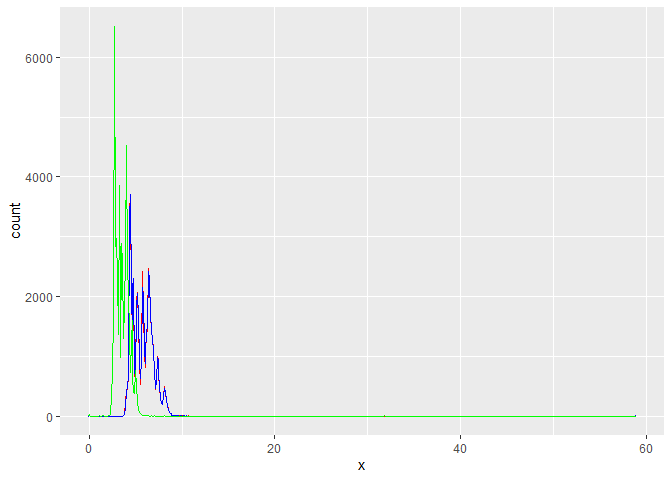
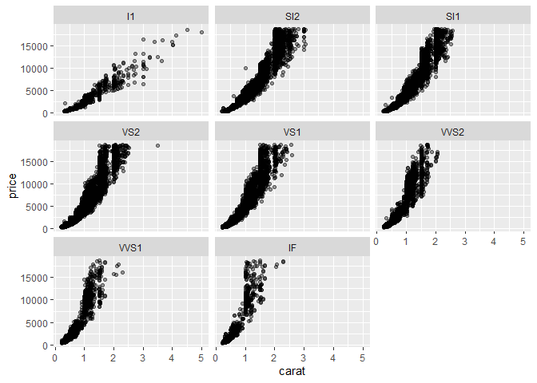

```r
library(tidyverse)
```

```
## -- Attaching packages -------------------------------------------------------------------------------- tidyverse 1.3.0 --
```

```
## v ggplot2 3.3.0     v purrr   0.3.3
## v tibble  3.0.0     v dplyr   0.8.5
## v tidyr   1.0.2     v stringr 1.4.0
## v readr   1.3.1     v forcats 0.5.0
```

```
## -- Conflicts ----------------------------------------------------------------------------------- tidyverse_conflicts() --
## x dplyr::filter() masks stats::filter()
## x dplyr::lag()    masks stats::lag()
```

```r
library(nycflights13)
```

# 7.3.4 Exercises

### 1. Explore the distribution of each of the ```x```, ```y```, and ```z``` variables in ```diamonds```. What do you learn? Think about a diamond and how you might decide which dimension is the length, width, and depth.


```r
ggplot(data = diamonds) +
  geom_freqpoly(binwidth=0.1,aes(x = x), color = "red") +
  geom_freqpoly(binwidth=0.1,aes(x = y), color = "blue") +
  geom_freqpoly(binwidth=0.1,aes(x = z), color  ="green") 
```

<!-- -->

### 2. Explore the distribution of price. Do you discover anything unusual or surprising? (Hint: Carefully think about the binwidth and make sure you try a wide range of values.)


```r
ggplot(data = diamonds, aes(x = price)) +
  geom_histogram(data = diamonds, aes(x = price))
```

```
## `stat_bin()` using `bins = 30`. Pick better value with `binwidth`.
```

<!-- -->

### 3. How many diamonds are 0.99 carat? How many are 1 carat? What do you think is the cause of the difference?


```r
filter(diamonds,carat==0.99) %>% count()
```

```
## # A tibble: 1 x 1
##       n
##   <int>
## 1    23
```


```r
filter(diamonds,carat==1) %>% count()
```

```
## # A tibble: 1 x 1
##       n
##   <int>
## 1  1558
```

### 4. Compare and contrast coord_cartesian() vs xlim() or ylim() when zooming in on a histogram. What happens if you leave binwidth unset? What happens if you try and zoom so only half a bar shows?


```r
diamonds %>% 
  ggplot() +
  geom_histogram(aes(x = carat))
```

```
## `stat_bin()` using `bins = 30`. Pick better value with `binwidth`.
```

<!-- -->


```r
diamonds %>% 
  ggplot() +
  geom_histogram( aes( x = carat ) ) +
  coord_cartesian(ylim=c(0,15000))
```

```
## `stat_bin()` using `bins = 30`. Pick better value with `binwidth`.
```

<!-- -->


```r
diamonds %>% 
  ggplot() +
  geom_histogram( aes( x = carat ) ) +
  ylim( c(0,7500) )
```

```
## `stat_bin()` using `bins = 30`. Pick better value with `binwidth`.
```

```
## Warning: Removed 2 rows containing missing values (geom_bar).
```

<!-- -->


# 7.4.1 Exercises

### 1. What happens to missing values in a histogram? What happens to missing values in a bar chart? Why is there a difference?

The missing values are removed from the charts.


### 2. What does ```na.rm = TRUE``` do in ```mean()``` and ```sum()```?

It removes ``na`` values while calculating mean and sum.


# 7.5.1.1 Exercises

### 1. Use what you’ve learned to improve the visualisation of the departure times of cancelled vs. non-cancelled flights.


```r
library(nycflights13)
```


```r
nycflights13::flights %>%
  mutate(
    cancelled=is.na(dep_time),
    sched_hour=sched_dep_time %/% 100,
    sched_min=sched_dep_time %% 100,
    sched_dep_time=sched_hour + sched_min / 60
  ) %>%
  ggplot() +
  geom_boxplot(mapping=aes(y=sched_dep_time, x=cancelled))
```

<!-- -->


### 2. What variable in the diamonds dataset is most important for predicting the price of a diamond? How is that variable correlated with cut? Why does the combination of those two relationships lead to lower quality diamonds being more expensive?


```r
ggplot(data=diamonds)+
  geom_violin(mapping=aes(x=cut, y=price))
```

<!-- -->


```r
ggplot(data=diamonds)+
  geom_point(mapping=aes(x=carat, y=price), alpha=0.4)+
  facet_wrap(~clarity)
```

<!-- -->

### 3.Install the ggstance package, and create a horizontal boxplot. How does this compare to using ```coord_flip()```?


```r
library(ggstance)
```

```
## 
## Attaching package: 'ggstance'
```

```
## The following objects are masked from 'package:ggplot2':
## 
##     geom_errorbarh, GeomErrorbarh
```

```r
nycflights13::flights %>%
  mutate(
    cancelled=is.na(dep_time),
    sched_hour=sched_dep_time %/% 100,
    sched_min=sched_dep_time %% 100,
    sched_dep_time=sched_hour + sched_min / 60
  ) %>%
ggplot()+
  geom_boxploth(mapping=aes(y=cancelled, x=sched_dep_time))
```

<!-- -->


```r
nycflights13::flights %>%
  mutate(
    cancelled=is.na(dep_time),
    sched_hour=sched_dep_time %/% 100,
    sched_min=sched_dep_time %% 100,
    sched_dep_time=sched_hour + sched_min / 60
  ) %>%
  ggplot()+
  geom_boxplot(mapping=aes(y=sched_dep_time, x=cancelled))+
  coord_flip()
```

<!-- -->


### 5.Compare and contrast ```geom_violin()``` with a facetted ```geom_histogram()```, or a coloured ```geom_freqpoly()```. What are the pros and cons of each method?


```r
nycflights13::flights %>%
  mutate(
    cancelled=is.na(dep_time),
    sched_hour=sched_dep_time %/% 100,
    sched_min=sched_dep_time %% 100,
    sched_dep_time=sched_hour + sched_min / 60
  ) %>%
ggplot()+
  geom_violin(mapping=aes(x=carrier,y=dep_time))
```

```
## Warning: Removed 8255 rows containing non-finite values (stat_ydensity).
```

<!-- -->


```r
ggplot(data=diamonds)+
  geom_violin(mapping=aes(x=cut, y=carat))
```

<!-- -->


```r
ggplot(data=diamonds)+
  geom_histogram(mapping=aes(x=carat))+
  facet_wrap(~cut)
```

```
## `stat_bin()` using `bins = 30`. Pick better value with `binwidth`.
```

<!-- -->


```r
ggplot(data=diamonds)+
  geom_boxplot(mapping=aes(x=cut, y=carat))
```

<!-- -->

### 6.If you have a small dataset, it’s sometimes useful to use ```geom_jitter()``` to see the relationship between a continuous and categorical variable. The ggbeeswarm package provides a number of methods similar to ```geom_jitter()```. List them and briefly describe what each one does.


```r
ggplot(data=diamonds)+
  geom_jitter(mapping=aes(x=cut, y=carat), alpha=0.4, dodge.width=0.8)
```

```
## Warning: Ignoring unknown parameters: dodge.width
```

<!-- -->

# 7.5.2 Exercises

### Describe an experiment that would have 2 categorical variables.

##### Arabidopsis seed packet families vs. existence of luciferase promoter.


# 7.5.3 Exercises

### Describe an experiment that would have 2 continuous variables.

##### Arabidopsis hypocotyl length vs. days since germination.


